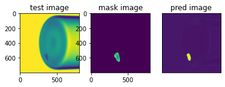

## Segmentation, Object detection samples/excercises

* Contains code for some task specific cv networks 
* Segmentation via unet and object detection networks via retina net
* retina net is forked from another github repo - https://github.com/yhenon/pytorch-retinanet
* Goal is not to get the best accuracy, but to get hands dirty with some non-classification apps

---
*sample segmentation result from unet*

